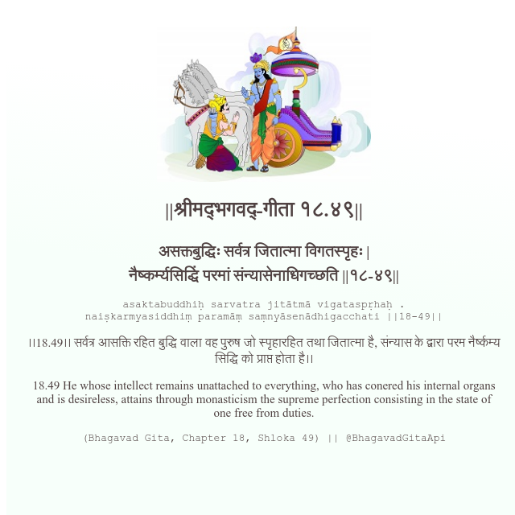

<h2>||श्रीमद्‍भगवद्‍-गीता १८.४९||</h2>
<h3>असक्तबुद्धिः सर्वत्र जितात्मा विगतस्पृहः | नैष्कर्म्यसिद्धिं परमां संन्यासेनाधिगच्छति ||१८-४९||</h3>
<pre>asaktabuddhiḥ sarvatra jitātmā vigataspṛhaḥ . naiṣkarmyasiddhiṃ paramāṃ saṃnyāsenādhigacchati ||18-49||</pre>

।।18.49।। सर्वत्र आसक्ति रहित बुद्धि वाला वह पुरुष जो स्पृहारहित तथा जितात्मा है, संन्यास के द्वारा परम नैर्ष्कम्य सिद्धि को प्राप्त होता है।।

<pre>(Bhagavad Gita, Chapter 18, Shloka 49) || @BhagavadGitaApi</pre>
https://bhagavadgitaapi.in/

#API #bhagavadgitaapi #slok #nodejs #js #api #gitaapi #krishna #hinduism #vedic #ISKCON #shreemadbhagavadgita #technology

