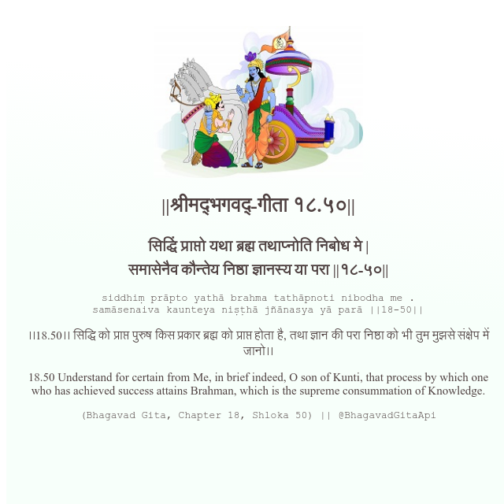

<h2>||श्रीमद्‍भगवद्‍-गीता १८.५०||</h2>
<h3>सिद्धिं प्राप्तो यथा ब्रह्म तथाप्नोति निबोध मे | समासेनैव कौन्तेय निष्ठा ज्ञानस्य या परा ||१८-५०||</h3>
<pre>siddhiṃ prāpto yathā brahma tathāpnoti nibodha me . samāsenaiva kaunteya niṣṭhā jñānasya yā parā ||18-50||</pre>

।।18.50।। सिद्धि को प्राप्त पुरुष किस प्रकार ब्रह्म को प्राप्त होता है, तथा ज्ञान की परा निष्ठा को भी तुम मुझसे संक्षेप में जानो।।

<pre>(Bhagavad Gita, Chapter 18, Shloka 50) || @BhagavadGitaApi</pre>
https://vedicscriptures.github.io/

#API #bhagavadgitaapi #slok #nodejs #js #api #gitaapi #krishna #hinduism #vedic #ISKCON #shreemadbhagavadgita #technology

