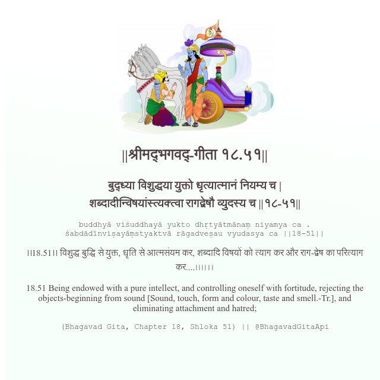

<h2>||श्रीमद्‍भगवद्‍-गीता १८.५१||</h2>
<h3>बुद्ध्या विशुद्धया युक्तो धृत्यात्मानं नियम्य च | शब्दादीन्विषयांस्त्यक्त्वा रागद्वेषौ व्युदस्य च ||१८-५१||</h3>
<pre>buddhyā viśuddhayā yukto dhṛtyātmānaṃ niyamya ca . śabdādīnviṣayāṃstyaktvā rāgadveṣau vyudasya ca ||18-51||</pre>

।।18.51।। विशुद्ध बुद्धि से युक्त, धृति से आत्मसंयम कर, शब्दादि विषयों को त्याग कर और राग-द्वेष का परित्याग कर....৷৷৷৷।।

<pre>(Bhagavad Gita, Chapter 18, Shloka 51) || @BhagavadGitaApi</pre>
https://bhagavadgitaapi.in/

#API #bhagavadgitaapi #slok #nodejs #js #api #gitaapi #krishna #hinduism #vedic #ISKCON #shreemadbhagavadgita #technology

