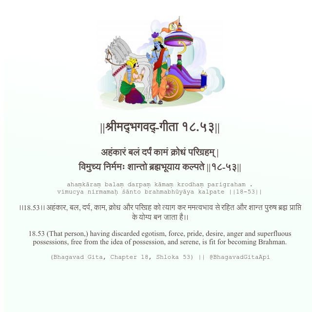

<h2>||श्रीमद्‍भगवद्‍-गीता १८.५३||</h2>
<h3>अहंकारं बलं दर्पं कामं क्रोधं परिग्रहम् | विमुच्य निर्ममः शान्तो ब्रह्मभूयाय कल्पते ||१८-५३||</h3>
<pre>ahaṃkāraṃ balaṃ darpaṃ kāmaṃ krodhaṃ parigraham . vimucya nirmamaḥ śānto brahmabhūyāya kalpate ||18-53||</pre>

।।18.53।। अहंकार, बल, दर्प, काम, क्रोध और परिग्रह को त्याग कर ममत्वभाव से रहित और शान्त पुरुष ब्रह्म प्राप्ति के योग्य बन जाता है।।

<pre>(Bhagavad Gita, Chapter 18, Shloka 53) || @BhagavadGitaApi</pre>
https://bhagavadgitaapi.in/

#API #bhagavadgitaapi #slok #nodejs #js #api #gitaapi #krishna #hinduism #vedic #ISKCON #shreemadbhagavadgita #technology

