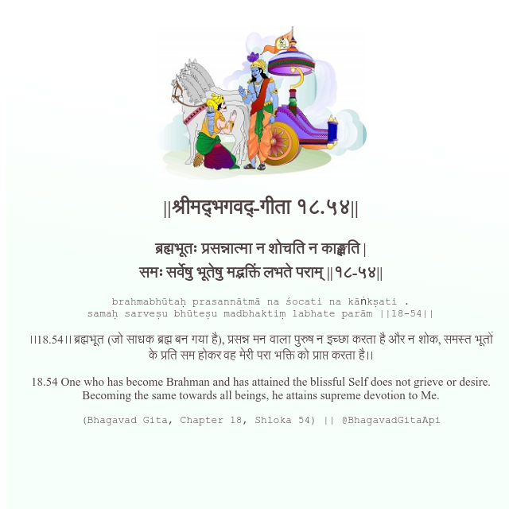

<h2>||श्रीमद्‍भगवद्‍-गीता १८.५४||</h2>
<h3>ब्रह्मभूतः प्रसन्नात्मा न शोचति न काङ्क्षति | समः सर्वेषु भूतेषु मद्भक्तिं लभते पराम् ||१८-५४||</h3>
<pre>brahmabhūtaḥ prasannātmā na śocati na kāṅkṣati . samaḥ sarveṣu bhūteṣu madbhaktiṃ labhate parām ||18-54||</pre>

।।18.54।। ब्रह्मभूत (जो साधक ब्रह्म बन गया है), प्रसन्न मन वाला पुरुष न इच्छा करता है और न शोक, समस्त भूतों के प्रति सम होकर वह मेरी परा भक्ति को प्राप्त करता है।।

<pre>(Bhagavad Gita, Chapter 18, Shloka 54) || @BhagavadGitaApi</pre>
https://docs.bhagavadgitaapi.in/

#API #bhagavadgitaapi #slok #nodejs #js #api #gitaapi #krishna #hinduism #vedic #ISKCON #shreemadbhagavadgita #technology

