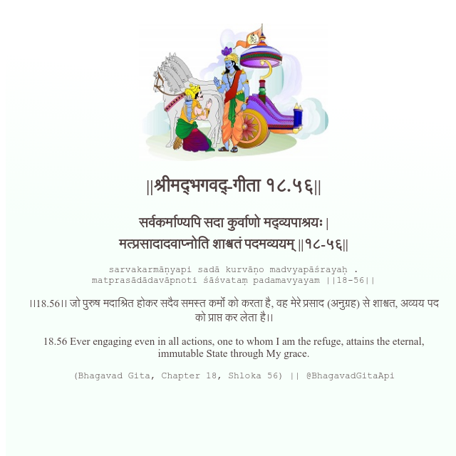

<h2>||श्रीमद्‍भगवद्‍-गीता १८.५६||</h2>
<h3>सर्वकर्माण्यपि सदा कुर्वाणो मद्व्यपाश्रयः | मत्प्रसादादवाप्नोति शाश्वतं पदमव्ययम् ||१८-५६||</h3>
<pre>sarvakarmāṇyapi sadā kurvāṇo madvyapāśrayaḥ . matprasādādavāpnoti śāśvataṃ padamavyayam ||18-56||</pre>

।।18.56।। जो पुरुष मदाश्रित होकर सदैव समस्त कर्मों को करता है, वह मेरे प्रसाद (अनुग्रह) से शाश्वत, अव्यय पद को प्राप्त कर लेता है।।

<pre>(Bhagavad Gita, Chapter 18, Shloka 56) || @BhagavadGitaApi</pre>
https://bhagavadgitaapi.in/

#API #bhagavadgitaapi #slok #nodejs #js #api #gitaapi #krishna #hinduism #vedic #ISKCON #shreemadbhagavadgita #technology

