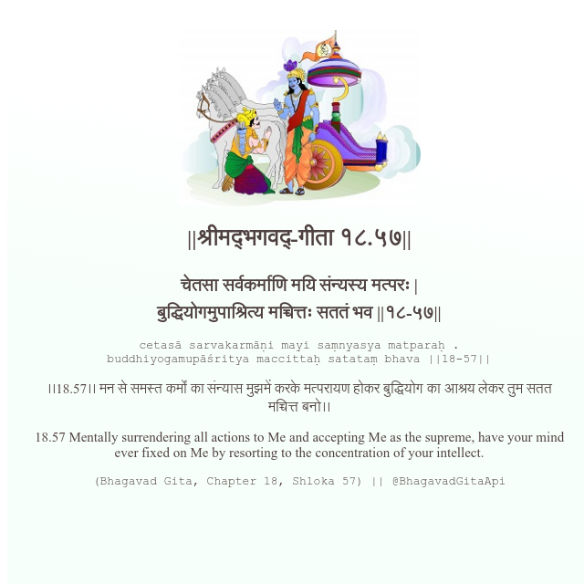

<h2>||श्रीमद्‍भगवद्‍-गीता १८.५७||</h2>
<h3>चेतसा सर्वकर्माणि मयि संन्यस्य मत्परः | बुद्धियोगमुपाश्रित्य मच्चित्तः सततं भव ||१८-५७||</h3>
<pre>cetasā sarvakarmāṇi mayi saṃnyasya matparaḥ . buddhiyogamupāśritya maccittaḥ satataṃ bhava ||18-57||</pre>

।।18.57।। मन से समस्त कर्मों का संन्यास मुझमें करके मत्परायण होकर बुद्धियोग का आश्रय लेकर तुम सतत मच्चित्त बनो।।

<pre>(Bhagavad Gita, Chapter 18, Shloka 57) || @BhagavadGitaApi</pre>
https://bhagavadgitaapi.in/

#API #bhagavadgitaapi #slok #nodejs #js #api #gitaapi #krishna #hinduism #vedic #ISKCON #shreemadbhagavadgita #technology

