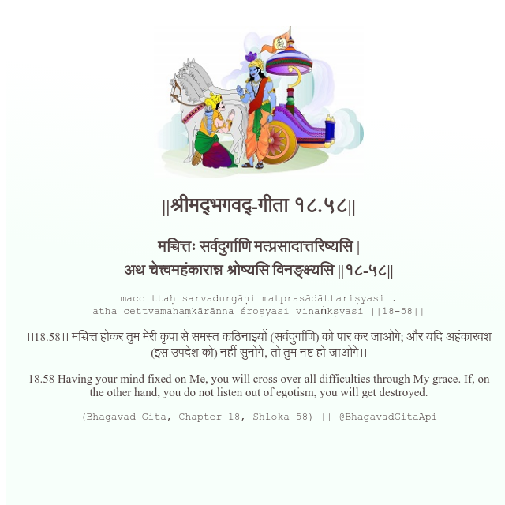

<h2>||श्रीमद्‍भगवद्‍-गीता १८.५८||</h2>
<h3>मच्चित्तः सर्वदुर्गाणि मत्प्रसादात्तरिष्यसि | अथ चेत्त्वमहंकारान्न श्रोष्यसि विनङ्क्ष्यसि ||१८-५८||</h3>
<pre>maccittaḥ sarvadurgāṇi matprasādāttariṣyasi . atha cettvamahaṃkārānna śroṣyasi vinaṅkṣyasi ||18-58||</pre>

।।18.58।। मच्चित्त होकर तुम मेरी कृपा से समस्त कठिनाइयों (सर्वदुर्गाणि) को पार कर जाओगे; और यदि अहंकारवश (इस उपदेश को) नहीं सुनोगे, तो तुम नष्ट हो जाओगे।।

<pre>(Bhagavad Gita, Chapter 18, Shloka 58) || @BhagavadGitaApi</pre>
https://docs.bhagavadgitaapi.in/

#API #bhagavadgitaapi #slok #nodejs #js #api #gitaapi #krishna #hinduism #vedic #ISKCON #shreemadbhagavadgita #technology

