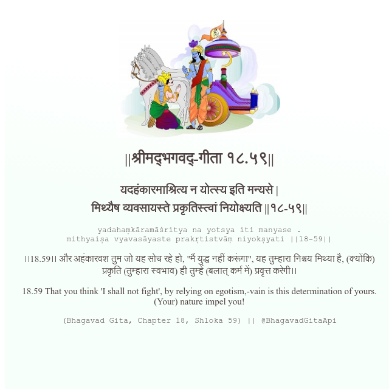

<h2>||श्रीमद्‍भगवद्‍-गीता १८.५९||</h2>
<h3>यदहंकारमाश्रित्य न योत्स्य इति मन्यसे | मिथ्यैष व्यवसायस्ते प्रकृतिस्त्वां नियोक्ष्यति ||१८-५९||</h3>
<pre>yadahaṃkāramāśritya na yotsya iti manyase . mithyaiṣa vyavasāyaste prakṛtistvāṃ niyokṣyati ||18-59||</pre>

।।18.59।। और अहंकारवश तुम जो यह सोच रहे हो, "मैं युद्ध नहीं करूंगा", यह तुम्हारा निश्चय मिथ्या है, (क्योंकि) प्रकृति (तुम्हारा स्वभाव) ही तुम्हें (बलात् कर्म में) प्रवृत्त करेगी।।

<pre>(Bhagavad Gita, Chapter 18, Shloka 59) || @BhagavadGitaApi</pre>
https://bhagavadgitaapi.in/

#API #bhagavadgitaapi #slok #nodejs #js #api #gitaapi #krishna #hinduism #vedic #ISKCON #shreemadbhagavadgita #technology

