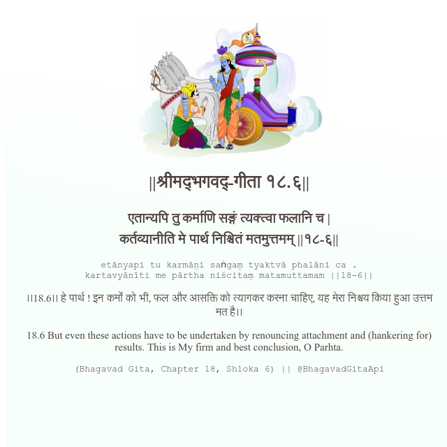

<h2>||श्रीमद्‍भगवद्‍-गीता १८.६||</h2>
<h3>एतान्यपि तु कर्माणि सङ्गं त्यक्त्वा फलानि च | कर्तव्यानीति मे पार्थ निश्चितं मतमुत्तमम् ||१८-६||</h3>
<pre>etānyapi tu karmāṇi saṅgaṃ tyaktvā phalāni ca . kartavyānīti me pārtha niścitaṃ matamuttamam ||18-6||</pre>

।।18.6।। हे पार्थ ! इन कर्मों को भी, फल और आसक्ति को त्यागकर करना चाहिए, यह मेरा निश्चय किया हुआ उत्तम मत है।।

<pre>(Bhagavad Gita, Chapter 18, Shloka 6) || @BhagavadGitaApi</pre>
https://docs.bhagavadgitaapi.in/

#API #bhagavadgitaapi #slok #nodejs #js #api #gitaapi #krishna #hinduism #vedic #ISKCON #shreemadbhagavadgita #technology

