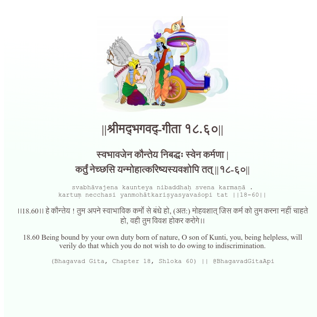

<h2>||श्रीमद्‍भगवद्‍-गीता १८.६०||</h2>
<h3>स्वभावजेन कौन्तेय निबद्धः स्वेन कर्मणा | कर्तुं नेच्छसि यन्मोहात्करिष्यस्यवशोपि तत् ||१८-६०||</h3>
<pre>svabhāvajena kaunteya nibaddhaḥ svena karmaṇā . kartuṃ necchasi yanmohātkariṣyasyavaśopi tat ||18-60||</pre>

।।18.60।। हे कौन्तेय ! तुम अपने स्वाभाविक कर्मों से बंधे हो, (अत:) मोहवशात् जिस कर्म को तुम करना नहीं चाहते हो, वही तुम विवश होकर करोगे।।

<pre>(Bhagavad Gita, Chapter 18, Shloka 60) || @BhagavadGitaApi</pre>
https://bhagavadgitaapi.in/

#API #bhagavadgitaapi #slok #nodejs #js #api #gitaapi #krishna #hinduism #vedic #ISKCON #shreemadbhagavadgita #technology

