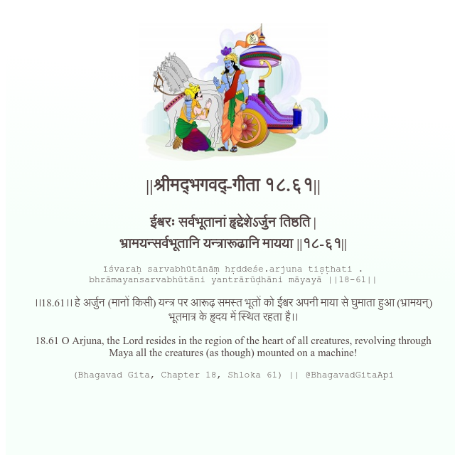

<h2>||श्रीमद्‍भगवद्‍-गीता १८.६१||</h2>
<h3>ईश्वरः सर्वभूतानां हृद्देशेऽर्जुन तिष्ठति | भ्रामयन्सर्वभूतानि यन्त्रारूढानि मायया ||१८-६१||</h3>
<pre>īśvaraḥ sarvabhūtānāṃ hṛddeśe.arjuna tiṣṭhati . bhrāmayansarvabhūtāni yantrārūḍhāni māyayā ||18-61||</pre>

।।18.61।। हे अर्जुन (मानों किसी) यन्त्र पर आरूढ़ समस्त भूतों को ईश्वर अपनी माया से घुमाता हुआ (भ्रामयन्) भूतमात्र के हृदय में स्थित रहता है।।

<pre>(Bhagavad Gita, Chapter 18, Shloka 61) || @BhagavadGitaApi</pre>
https://vedicscriptures.github.io/

#API #bhagavadgitaapi #slok #nodejs #js #api #gitaapi #krishna #hinduism #vedic #ISKCON #shreemadbhagavadgita #technology

