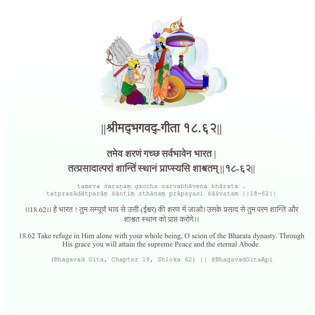

<h2>||श्रीमद्‍भगवद्‍-गीता १८.६२||</h2>
<h3>तमेव शरणं गच्छ सर्वभावेन भारत | तत्प्रसादात्परां शान्तिं स्थानं प्राप्स्यसि शाश्वतम् ||१८-६२||</h3>
<pre>tameva śaraṇaṃ gaccha sarvabhāvena bhārata . tatprasādātparāṃ śāntiṃ sthānaṃ prāpsyasi śāśvatam ||18-62||</pre>

।।18.62।। हे भारत ! तुम सम्पूर्ण भाव से उसी (ईश्वर) की शरण में जाओ। उसके प्रसाद से तुम परम शान्ति और शाश्वत स्थान को प्राप्त करोगे।।

<pre>(Bhagavad Gita, Chapter 18, Shloka 62) || @BhagavadGitaApi</pre>
https://vedicscriptures.github.io/

#API #bhagavadgitaapi #slok #nodejs #js #api #gitaapi #krishna #hinduism #vedic #ISKCON #shreemadbhagavadgita #technology

