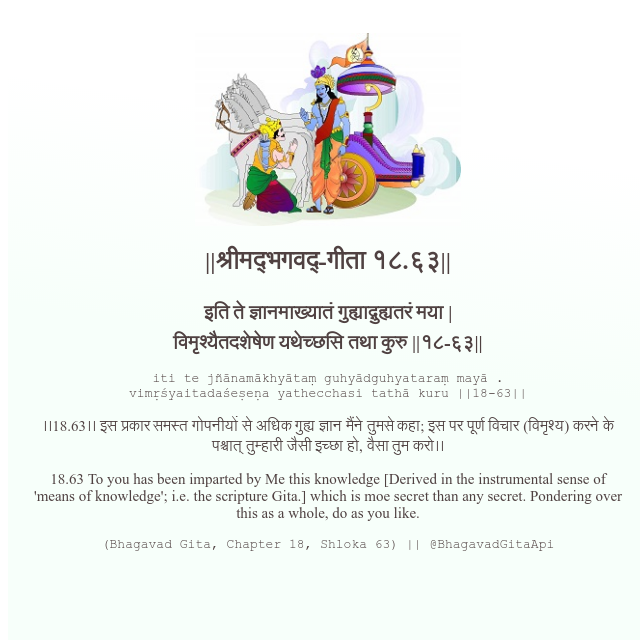

<h2>||श्रीमद्‍भगवद्‍-गीता १८.६३||</h2>
<h3>इति ते ज्ञानमाख्यातं गुह्याद्गुह्यतरं मया | विमृश्यैतदशेषेण यथेच्छसि तथा कुरु ||१८-६३||</h3>
<pre>iti te jñānamākhyātaṃ guhyādguhyataraṃ mayā . vimṛśyaitadaśeṣeṇa yathecchasi tathā kuru ||18-63||</pre>

।।18.63।। इस प्रकार समस्त गोपनीयों से अधिक गुह्य ज्ञान मैंने तुमसे कहा; इस पर पूर्ण विचार (विमृश्य) करने के पश्चात् तुम्हारी जैसी इच्छा हो, वैसा तुम करो।।

<pre>(Bhagavad Gita, Chapter 18, Shloka 63) || @BhagavadGitaApi</pre>
https://docs.bhagavadgitaapi.in/

#API #bhagavadgitaapi #slok #nodejs #js #api #gitaapi #krishna #hinduism #vedic #ISKCON #shreemadbhagavadgita #technology

