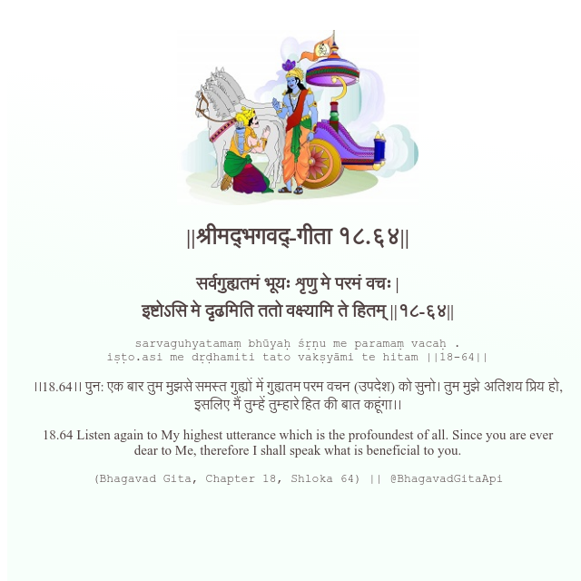

<h2>||श्रीमद्‍भगवद्‍-गीता १८.६४||</h2>
<h3>सर्वगुह्यतमं भूयः शृणु मे परमं वचः | इष्टोऽसि मे दृढमिति ततो वक्ष्यामि ते हितम् ||१८-६४||</h3>
<pre>sarvaguhyatamaṃ bhūyaḥ śṛṇu me paramaṃ vacaḥ . iṣṭo.asi me dṛḍhamiti tato vakṣyāmi te hitam ||18-64||</pre>

।।18.64।। पुन: एक बार तुम मुझसे समस्त गुह्यों में गुह्यतम परम वचन (उपदेश) को सुनो। तुम मुझे अतिशय प्रिय हो, इसलिए मैं तुम्हें तुम्हारे हित की बात कहूंगा।।

<pre>(Bhagavad Gita, Chapter 18, Shloka 64) || @BhagavadGitaApi</pre>
https://docs.bhagavadgitaapi.in/

#API #bhagavadgitaapi #slok #nodejs #js #api #gitaapi #krishna #hinduism #vedic #ISKCON #shreemadbhagavadgita #technology

