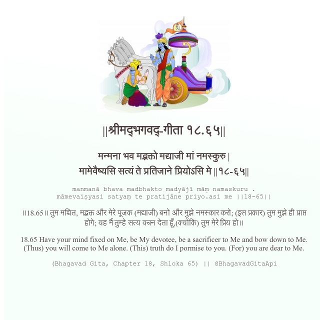

<h2>||श्रीमद्‍भगवद्‍-गीता १८.६५||</h2>
<h3>मन्मना भव मद्भक्तो मद्याजी मां नमस्कुरु | मामेवैष्यसि सत्यं ते प्रतिजाने प्रियोऽसि मे ||१८-६५||</h3>
<pre>manmanā bhava madbhakto madyājī māṃ namaskuru . māmevaiṣyasi satyaṃ te pratijāne priyo.asi me ||18-65||</pre>

।।18.65।। तुम मच्चित, मद्भक्त और मेरे पूजक (मद्याजी) बनो और मुझे नमस्कार करो; (इस प्रकार) तुम मुझे ही प्राप्त होगे; यह मैं तुम्हे सत्य वचन देता हूँ,(क्योंकि) तुम मेरे प्रिय हो।।

<pre>(Bhagavad Gita, Chapter 18, Shloka 65) || @BhagavadGitaApi</pre>
https://vedicscriptures.github.io/

#API #bhagavadgitaapi #slok #nodejs #js #api #gitaapi #krishna #hinduism #vedic #ISKCON #shreemadbhagavadgita #technology

