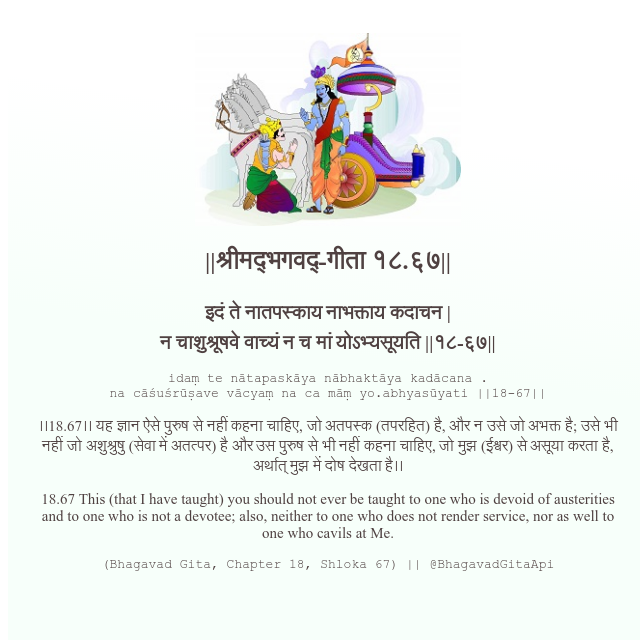

<h2>||श्रीमद्‍भगवद्‍-गीता १८.६७||</h2>
<h3>इदं ते नातपस्काय नाभक्ताय कदाचन | न चाशुश्रूषवे वाच्यं न च मां योऽभ्यसूयति ||१८-६७||</h3>
<pre>idaṃ te nātapaskāya nābhaktāya kadācana . na cāśuśrūṣave vācyaṃ na ca māṃ yo.abhyasūyati ||18-67||</pre>

।।18.67।। यह ज्ञान ऐसे पुरुष से नहीं कहना चाहिए, जो अतपस्क (तपरहित) है, और न उसे जो अभक्त है; उसे भी नहीं जो अशुश्रुषु (सेवा में अतत्पर) है और उस पुरुष से भी नहीं कहना चाहिए, जो मुझ (ईश्वर) से असूया करता है, अर्थात् मुझ में दोष देखता है।।

<pre>(Bhagavad Gita, Chapter 18, Shloka 67) || @BhagavadGitaApi</pre>
https://docs.bhagavadgitaapi.in/

#API #bhagavadgitaapi #slok #nodejs #js #api #gitaapi #krishna #hinduism #vedic #ISKCON #shreemadbhagavadgita #technology

