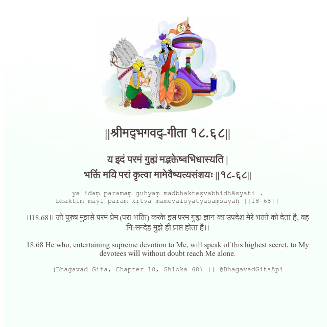

<h2>||श्रीमद्‍भगवद्‍-गीता १८.६८||</h2>
<h3>य इदं परमं गुह्यं मद्भक्तेष्वभिधास्यति | भक्तिं मयि परां कृत्वा मामेवैष्यत्यसंशयः ||१८-६८||</h3>
<pre>ya idaṃ paramaṃ guhyaṃ madbhakteṣvabhidhāsyati . bhaktiṃ mayi parāṃ kṛtvā māmevaiṣyatyasaṃśayaḥ ||18-68||</pre>

।।18.68।। जो पुरुष मुझसे परम प्रेम (परा भक्ति) करके इस परम गुह्य ज्ञान का उपदेश मेरे भक्तों को देता है, वह नि:सन्देह मुझे ही प्राप्त होता है।।

<pre>(Bhagavad Gita, Chapter 18, Shloka 68) || @BhagavadGitaApi</pre>
https://docs.bhagavadgitaapi.in/

#API #bhagavadgitaapi #slok #nodejs #js #api #gitaapi #krishna #hinduism #vedic #ISKCON #shreemadbhagavadgita #technology

