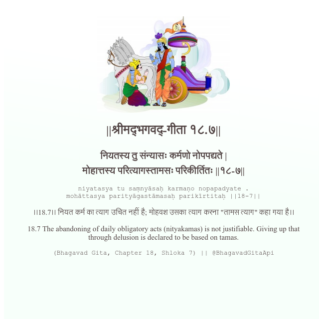

<h2>||श्रीमद्‍भगवद्‍-गीता १८.७||</h2>
<h3>नियतस्य तु संन्यासः कर्मणो नोपपद्यते | मोहात्तस्य परित्यागस्तामसः परिकीर्तितः ||१८-७||</h3>
<pre>niyatasya tu saṃnyāsaḥ karmaṇo nopapadyate . mohāttasya parityāgastāmasaḥ parikīrtitaḥ ||18-7||</pre>

।।18.7।। नियत कर्म का त्याग उचित नहीं है; मोहवश उसका त्याग करना "तामस त्याग" कहा गया है।।

<pre>(Bhagavad Gita, Chapter 18, Shloka 7) || @BhagavadGitaApi</pre>
https://vedicscriptures.github.io/

#API #bhagavadgitaapi #slok #nodejs #js #api #gitaapi #krishna #hinduism #vedic #ISKCON #shreemadbhagavadgita #technology

