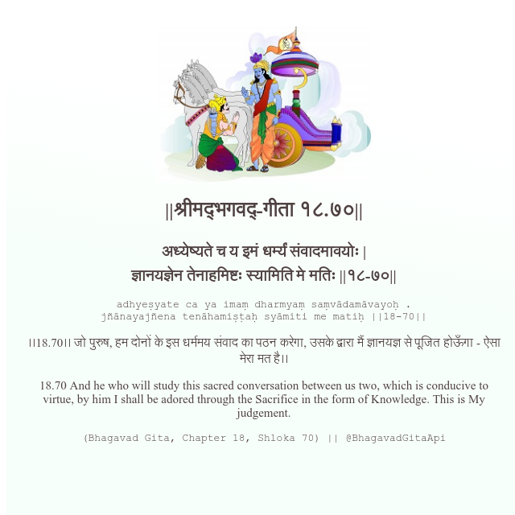

<h2>||श्रीमद्‍भगवद्‍-गीता १८.७०||</h2>
<h3>अध्येष्यते च य इमं धर्म्यं संवादमावयोः | ज्ञानयज्ञेन तेनाहमिष्टः स्यामिति मे मतिः ||१८-७०||</h3>
<pre>adhyeṣyate ca ya imaṃ dharmyaṃ saṃvādamāvayoḥ . jñānayajñena tenāhamiṣṭaḥ syāmiti me matiḥ ||18-70||</pre>

।।18.70।। जो पुरुष, हम दोनों के इस धर्ममय संवाद का पठन करेगा, उसके द्वारा मैं ज्ञानयज्ञ से पूजित होऊँगा - ऐसा मेरा मत है।।

<pre>(Bhagavad Gita, Chapter 18, Shloka 70) || @BhagavadGitaApi</pre>
https://vedicscriptures.github.io/

#API #bhagavadgitaapi #slok #nodejs #js #api #gitaapi #krishna #hinduism #vedic #ISKCON #shreemadbhagavadgita #technology

