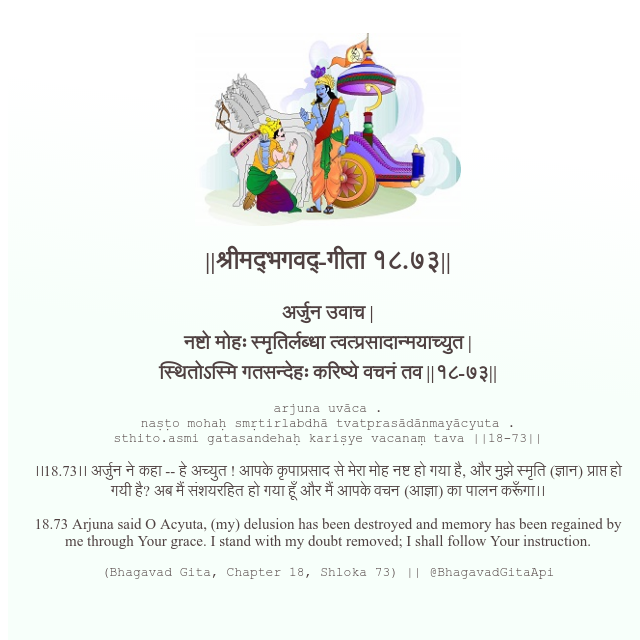

<h2>||श्रीमद्‍भगवद्‍-गीता १८.७३||</h2>
<h3>अर्जुन उवाच | नष्टो मोहः स्मृतिर्लब्धा त्वत्प्रसादान्मयाच्युत | स्थितोऽस्मि गतसन्देहः करिष्ये वचनं तव ||१८-७३||</h3>
<pre>arjuna uvāca . naṣṭo mohaḥ smṛtirlabdhā tvatprasādānmayācyuta . sthito.asmi gatasandehaḥ kariṣye vacanaṃ tava ||18-73||</pre>

।।18.73।। अर्जुन ने कहा -- हे अच्युत ! आपके कृपाप्रसाद से मेरा मोह नष्ट हो गया है, और मुझे स्मृति (ज्ञान) प्राप्त हो गयी है? अब मैं संशयरहित हो गया हूँ और मैं आपके वचन (आज्ञा) का पालन करूँगा।।

<pre>(Bhagavad Gita, Chapter 18, Shloka 73) || @BhagavadGitaApi</pre>
https://bhagavadgitaapi.in/

#API #bhagavadgitaapi #slok #nodejs #js #api #gitaapi #krishna #hinduism #vedic #ISKCON #shreemadbhagavadgita #technology

