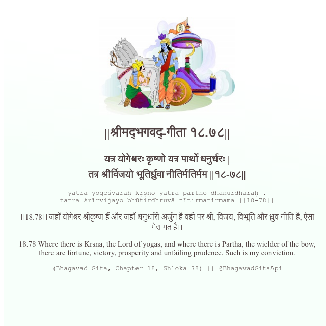

<h2>||श्रीमद्‍भगवद्‍-गीता १८.७८||</h2>
<h3>यत्र योगेश्वरः कृष्णो यत्र पार्थो धनुर्धरः | तत्र श्रीर्विजयो भूतिर्ध्रुवा नीतिर्मतिर्मम ||१८-७८||</h3>
<pre>yatra yogeśvaraḥ kṛṣṇo yatra pārtho dhanurdharaḥ . tatra śrīrvijayo bhūtirdhruvā nītirmatirmama ||18-78||</pre>

।।18.78।। जहाँ योगेश्वर श्रीकृष्ण हैं और जहाँ धनुर्धारी अर्जुन है वहीं पर श्री, विजय, विभूति और ध्रुव नीति है, ऐसा मेरा मत है।।

<pre>(Bhagavad Gita, Chapter 18, Shloka 78) || @BhagavadGitaApi</pre>
https://vedicscriptures.github.io/

#API #bhagavadgitaapi #slok #nodejs #js #api #gitaapi #krishna #hinduism #vedic #ISKCON #shreemadbhagavadgita #technology

