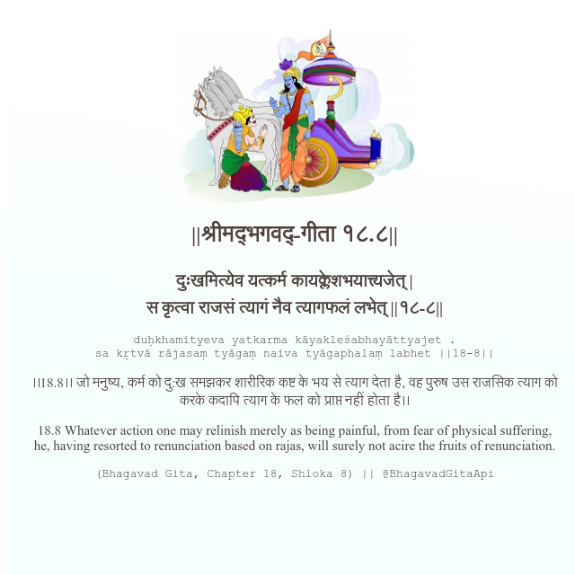

<h2>||श्रीमद्‍भगवद्‍-गीता १८.८||</h2>
<h3>दुःखमित्येव यत्कर्म कायक्लेशभयात्त्यजेत् | स कृत्वा राजसं त्यागं नैव त्यागफलं लभेत् ||१८-८||</h3>
<pre>duḥkhamityeva yatkarma kāyakleśabhayāttyajet . sa kṛtvā rājasaṃ tyāgaṃ naiva tyāgaphalaṃ labhet ||18-8||</pre>

।।18.8।। जो मनुष्य, कर्म को दु:ख समझकर शारीरिक कष्ट के भय से त्याग देता है, वह पुरुष उस राजसिक त्याग को करके कदापि त्याग के फल को प्राप्त नहीं होता है।।

<pre>(Bhagavad Gita, Chapter 18, Shloka 8) || @BhagavadGitaApi</pre>
https://docs.bhagavadgitaapi.in/

#API #bhagavadgitaapi #slok #nodejs #js #api #gitaapi #krishna #hinduism #vedic #ISKCON #shreemadbhagavadgita #technology

