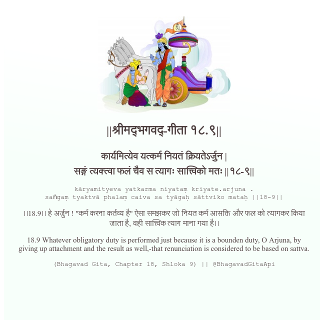

<h2>||श्रीमद्‍भगवद्‍-गीता १८.९||</h2>
<h3>कार्यमित्येव यत्कर्म नियतं क्रियतेऽर्जुन | सङ्गं त्यक्त्वा फलं चैव स त्यागः सात्त्विको मतः ||१८-९||</h3>
<pre>kāryamityeva yatkarma niyataṃ kriyate.arjuna . saṅgaṃ tyaktvā phalaṃ caiva sa tyāgaḥ sāttviko mataḥ ||18-9||</pre>

।।18.9।। हे अर्जुन ! "कर्म करना कर्तव्य है" ऐसा समझकर जो नियत कर्म आसक्ति और फल को त्यागकर किया जाता है, वही सात्त्विक त्याग माना गया है।।

<pre>(Bhagavad Gita, Chapter 18, Shloka 9) || @BhagavadGitaApi</pre>
https://docs.bhagavadgitaapi.in/

#API #bhagavadgitaapi #slok #nodejs #js #api #gitaapi #krishna #hinduism #vedic #ISKCON #shreemadbhagavadgita #technology

