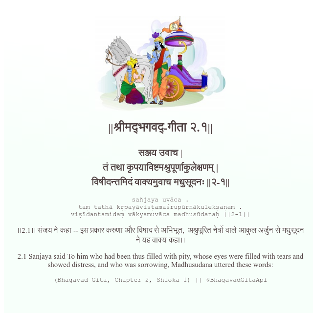

<h2>||श्रीमद्‍भगवद्‍-गीता २.१||</h2>
<h3>सञ्जय उवाच | तं तथा कृपयाविष्टमश्रुपूर्णाकुलेक्षणम् | विषीदन्तमिदं वाक्यमुवाच मधुसूदनः ||२-१||</h3>
<pre>sañjaya uvāca . taṃ tathā kṛpayāviṣṭamaśrupūrṇākulekṣaṇam . viṣīdantamidaṃ vākyamuvāca madhusūdanaḥ ||2-1||</pre>

।।2.1।। संजय ने कहा -- इस प्रकार करुणा और विषाद से अभिभूत,  अश्रुपूरित नेत्रों वाले आकुल अर्जुन से मधुसूदन ने यह वाक्य कहा।।

<pre>(Bhagavad Gita, Chapter 2, Shloka 1) || @BhagavadGitaApi</pre>
https://bhagavadgitaapi.in/

#API #bhagavadgitaapi #slok #nodejs #js #api #gitaapi #krishna #hinduism #vedic #ISKCON #shreemadbhagavadgita #technology

