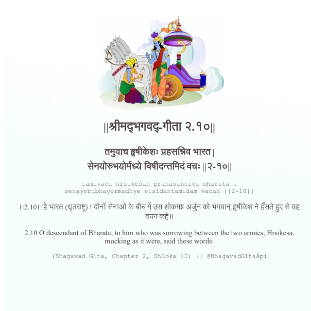

<h2>||श्रीमद्‍भगवद्‍-गीता २.१०||</h2>
<h3>तमुवाच हृषीकेशः प्रहसन्निव भारत | सेनयोरुभयोर्मध्ये विषीदन्तमिदं वचः ||२-१०||</h3>
<pre>tamuvāca hṛṣīkeśaḥ prahasanniva bhārata . senayorubhayormadhye viṣīdantamidaṃ vacaḥ ||2-10||</pre>

।।2.10।। हे भारत (धृतराष्ट्र) ! दोनों सेनाओं के बीच में उस शोकमग्न अर्जुन को भगवान् हृषीकेश ने हँसते हुए से यह वचन कहे।।

<pre>(Bhagavad Gita, Chapter 2, Shloka 10) || @BhagavadGitaApi</pre>
https://docs.bhagavadgitaapi.in/

#API #bhagavadgitaapi #slok #nodejs #js #api #gitaapi #krishna #hinduism #vedic #ISKCON #shreemadbhagavadgita #technology

