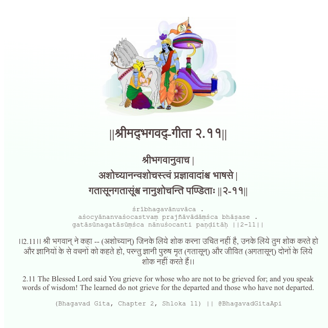

<h2>||श्रीमद्‍भगवद्‍-गीता २.११||</h2>
<h3>श्रीभगवानुवाच | अशोच्यानन्वशोचस्त्वं प्रज्ञावादांश्च भाषसे | गतासूनगतासूंश्च नानुशोचन्ति पण्डिताः ||२-११||</h3>
<pre>śrībhagavānuvāca . aśocyānanvaśocastvaṃ prajñāvādāṃśca bhāṣase . gatāsūnagatāsūṃśca nānuśocanti paṇḍitāḥ ||2-11||</pre>

।।2.11।। श्री भगवान् ने कहा -- (अशोच्यान्) जिनके लिये शोक करना उचित नहीं है, उनके लिये तुम शोक करते हो और ज्ञानियों के से वचनों को कहते हो, परन्तु ज्ञानी पुरुष मृत (गतासून्) और जीवित (अगतासून्) दोनों के लिये शोक नहीं करते हैं।।

<pre>(Bhagavad Gita, Chapter 2, Shloka 11) || @BhagavadGitaApi</pre>
https://vedicscriptures.github.io/

#API #bhagavadgitaapi #slok #nodejs #js #api #gitaapi #krishna #hinduism #vedic #ISKCON #shreemadbhagavadgita #technology

