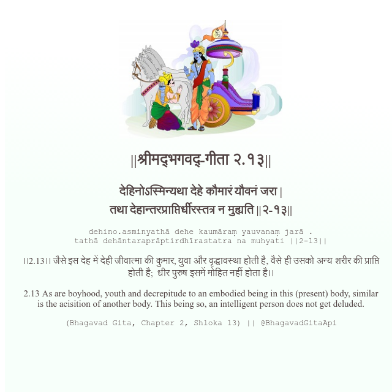

<h2>||श्रीमद्‍भगवद्‍-गीता २.१३||</h2>
<h3>देहिनोऽस्मिन्यथा देहे कौमारं यौवनं जरा | तथा देहान्तरप्राप्तिर्धीरस्तत्र न मुह्यति ||२-१३||</h3>
<pre>dehino.asminyathā dehe kaumāraṃ yauvanaṃ jarā . tathā dehāntaraprāptirdhīrastatra na muhyati ||2-13||</pre>

।।2.13।। जैसे इस देह में देही जीवात्मा की कुमार, युवा और वृद्धावस्था होती है, वैसे ही उसको अन्य शरीर की प्राप्ति होती है;  धीर पुरुष इसमें मोहित नहीं होता है।।

<pre>(Bhagavad Gita, Chapter 2, Shloka 13) || @BhagavadGitaApi</pre>
https://vedicscriptures.github.io/

#API #bhagavadgitaapi #slok #nodejs #js #api #gitaapi #krishna #hinduism #vedic #ISKCON #shreemadbhagavadgita #technology

