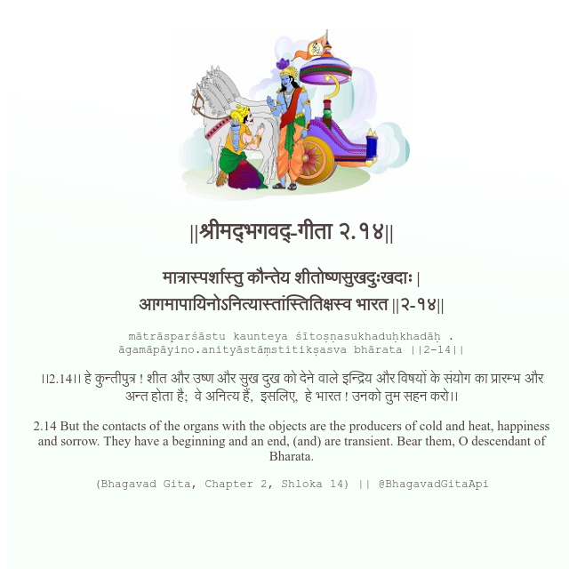

<h2>||श्रीमद्‍भगवद्‍-गीता २.१४||</h2>
<h3>मात्रास्पर्शास्तु कौन्तेय शीतोष्णसुखदुःखदाः | आगमापायिनोऽनित्यास्तांस्तितिक्षस्व भारत ||२-१४||</h3>
<pre>mātrāsparśāstu kaunteya śītoṣṇasukhaduḥkhadāḥ . āgamāpāyino.anityāstāṃstitikṣasva bhārata ||2-14||</pre>

।।2.14।। हे कुन्तीपुत्र ! शीत और उष्ण और सुख दुख को देने वाले इन्द्रिय और विषयों के संयोग का प्रारम्भ और अन्त होता है;  वे अनित्य हैं,  इसलिए,  हे भारत ! उनको तुम सहन करो।।

<pre>(Bhagavad Gita, Chapter 2, Shloka 14) || @BhagavadGitaApi</pre>
https://docs.bhagavadgitaapi.in/

#API #bhagavadgitaapi #slok #nodejs #js #api #gitaapi #krishna #hinduism #vedic #ISKCON #shreemadbhagavadgita #technology

