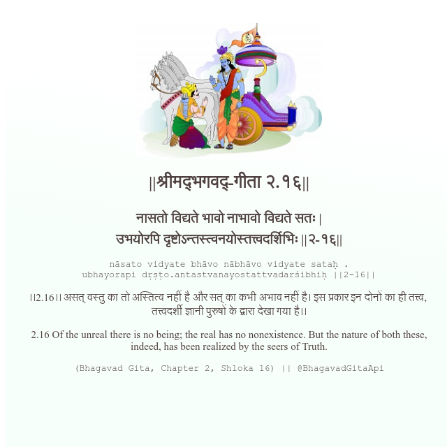

<h2>||श्रीमद्‍भगवद्‍-गीता २.१६||</h2>
<h3>नासतो विद्यते भावो नाभावो विद्यते सतः | उभयोरपि दृष्टोऽन्तस्त्वनयोस्तत्त्वदर्शिभिः ||२-१६||</h3>
<pre>nāsato vidyate bhāvo nābhāvo vidyate sataḥ . ubhayorapi dṛṣṭo.antastvanayostattvadarśibhiḥ ||2-16||</pre>

।।2.16।। असत् वस्तु का तो अस्तित्व नहीं है और सत् का कभी अभाव नहीं है। इस प्रकार इन दोनों का ही तत्त्व,  तत्त्वदर्शी ज्ञानी पुरुषों के द्वारा देखा गया है।।

<pre>(Bhagavad Gita, Chapter 2, Shloka 16) || @BhagavadGitaApi</pre>
https://bhagavadgitaapi.in/

#API #bhagavadgitaapi #slok #nodejs #js #api #gitaapi #krishna #hinduism #vedic #ISKCON #shreemadbhagavadgita #technology

