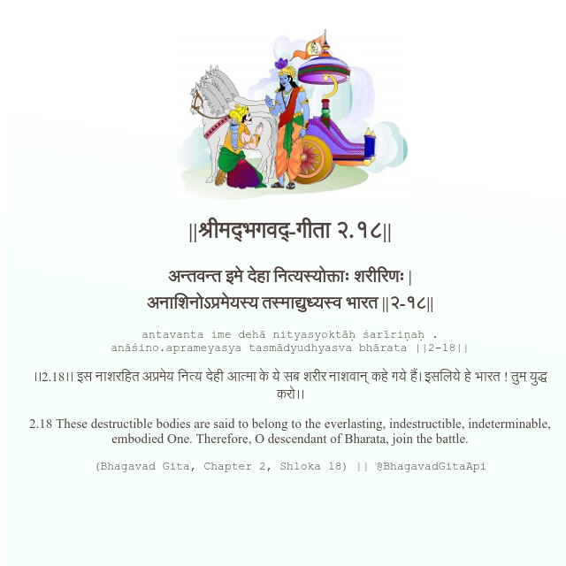

<h2>||श्रीमद्‍भगवद्‍-गीता २.१८||</h2>
<h3>अन्तवन्त इमे देहा नित्यस्योक्ताः शरीरिणः | अनाशिनोऽप्रमेयस्य तस्माद्युध्यस्व भारत ||२-१८||</h3>
<pre>antavanta ime dehā nityasyoktāḥ śarīriṇaḥ . anāśino.aprameyasya tasmādyudhyasva bhārata ||2-18||</pre>

।।2.18।। इस नाशरहित अप्रमेय नित्य देही आत्मा के ये सब शरीर नाशवान् कहे गये हैं। इसलिये हे भारत ! तुम युद्ध करो।।

<pre>(Bhagavad Gita, Chapter 2, Shloka 18) || @BhagavadGitaApi</pre>
https://vedicscriptures.github.io/

#API #bhagavadgitaapi #slok #nodejs #js #api #gitaapi #krishna #hinduism #vedic #ISKCON #shreemadbhagavadgita #technology

