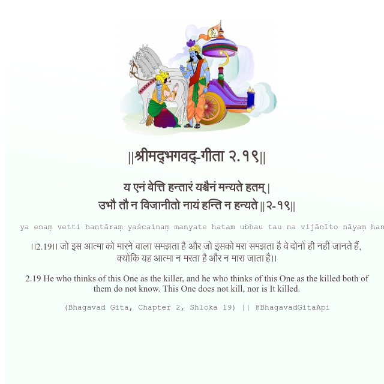

<h2>||श्रीमद्‍भगवद्‍-गीता २.१९||</h2>
<h3>य एनं वेत्ति हन्तारं यश्चैनं मन्यते हतम् | उभौ तौ न विजानीतो नायं हन्ति न हन्यते ||२-१९||</h3>
<pre>ya enaṃ vetti hantāraṃ yaścainaṃ manyate hatam ubhau tau na vijānīto nāyaṃ hanti na hanyate ||2-19||</pre>

।।2.19।। जो इस आत्मा को मारने वाला समझता है और जो इसको मरा समझता है वे दोनों ही नहीं जानते हैं,  क्योंकि यह आत्मा न मरता है और न मारा जाता है।।

<pre>(Bhagavad Gita, Chapter 2, Shloka 19) || @BhagavadGitaApi</pre>
https://vedicscriptures.github.io/

#API #bhagavadgitaapi #slok #nodejs #js #api #gitaapi #krishna #hinduism #vedic #ISKCON #shreemadbhagavadgita #technology

