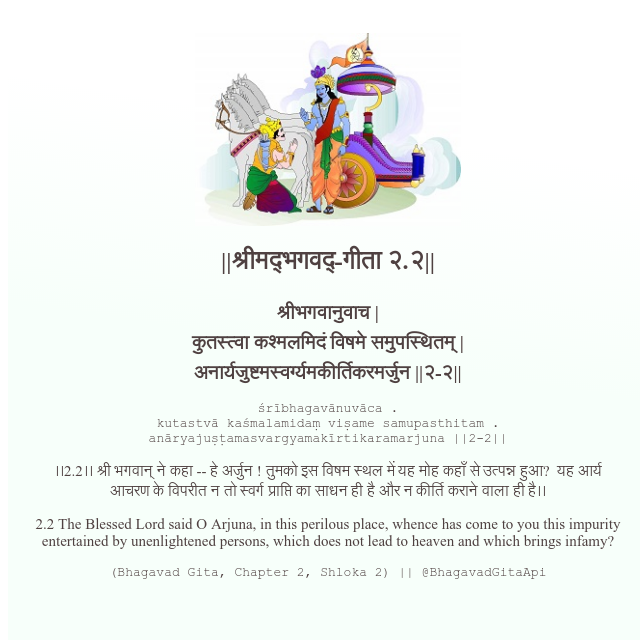

<h2>||श्रीमद्‍भगवद्‍-गीता २.२||</h2>
<h3>श्रीभगवानुवाच | कुतस्त्वा कश्मलमिदं विषमे समुपस्थितम् | अनार्यजुष्टमस्वर्ग्यमकीर्तिकरमर्जुन ||२-२||</h3>
<pre>śrībhagavānuvāca . kutastvā kaśmalamidaṃ viṣame samupasthitam . anāryajuṣṭamasvargyamakīrtikaramarjuna ||2-2||</pre>

।।2.2।। श्री भगवान् ने कहा -- हे अर्जुन ! तुमको इस विषम स्थल में यह मोह कहाँ से उत्पन्न हुआ?  यह आर्य आचरण के विपरीत न तो स्वर्ग प्राप्ति का साधन ही है और न कीर्ति कराने वाला ही है।।

<pre>(Bhagavad Gita, Chapter 2, Shloka 2) || @BhagavadGitaApi</pre>
https://vedicscriptures.github.io/

#API #bhagavadgitaapi #slok #nodejs #js #api #gitaapi #krishna #hinduism #vedic #ISKCON #shreemadbhagavadgita #technology

