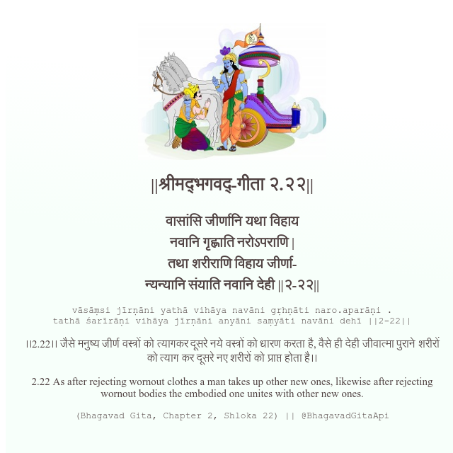

<h2>||श्रीमद्‍भगवद्‍-गीता २.२२||</h2>
<h3>वासांसि जीर्णानि यथा विहाय नवानि गृह्णाति नरोऽपराणि | तथा शरीराणि विहाय जीर्णा- न्यन्यानि संयाति नवानि देही ||२-२२||</h3>
<pre>vāsāṃsi jīrṇāni yathā vihāya navāni gṛhṇāti naro.aparāṇi . tathā śarīrāṇi vihāya jīrṇāni anyāni saṃyāti navāni dehī ||2-22||</pre>

।।2.22।। जैसे मनुष्य जीर्ण वस्त्रों को त्यागकर दूसरे नये वस्त्रों को धारण करता है, वैसे ही देही जीवात्मा पुराने शरीरों को त्याग कर दूसरे नए शरीरों को प्राप्त होता है।।

<pre>(Bhagavad Gita, Chapter 2, Shloka 22) || @BhagavadGitaApi</pre>
https://vedicscriptures.github.io/

#API #bhagavadgitaapi #slok #nodejs #js #api #gitaapi #krishna #hinduism #vedic #ISKCON #shreemadbhagavadgita #technology

