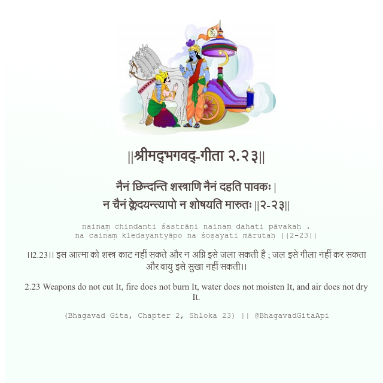

<h2>||श्रीमद्‍भगवद्‍-गीता २.२३||</h2>
<h3>नैनं छिन्दन्ति शस्त्राणि नैनं दहति पावकः | न चैनं क्लेदयन्त्यापो न शोषयति मारुतः ||२-२३||</h3>
<pre>nainaṃ chindanti śastrāṇi nainaṃ dahati pāvakaḥ . na cainaṃ kledayantyāpo na śoṣayati mārutaḥ ||2-23||</pre>

।।2.23।। इस आत्मा को शस्त्र काट नहीं सकते और न अग्नि इसे जला सकती है ; जल इसे गीला नहीं कर सकता और वायु इसे सुखा नहीं सकती।।

<pre>(Bhagavad Gita, Chapter 2, Shloka 23) || @BhagavadGitaApi</pre>
https://vedicscriptures.github.io/

#API #bhagavadgitaapi #slok #nodejs #js #api #gitaapi #krishna #hinduism #vedic #ISKCON #shreemadbhagavadgita #technology

