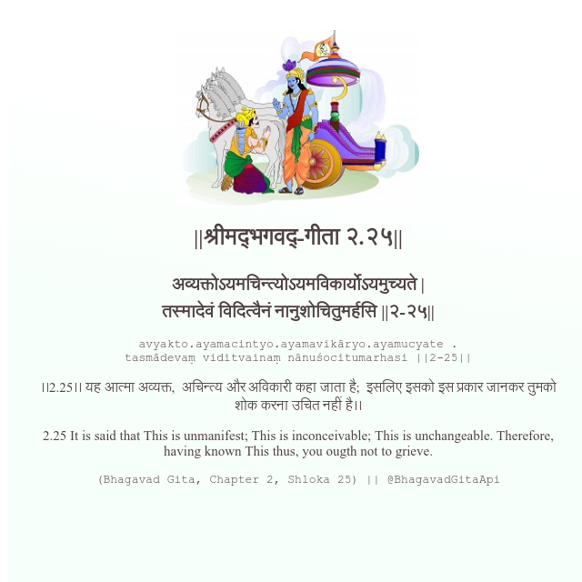

<h2>||श्रीमद्‍भगवद्‍-गीता २.२५||</h2>
<h3>अव्यक्तोऽयमचिन्त्योऽयमविकार्योऽयमुच्यते | तस्मादेवं विदित्वैनं नानुशोचितुमर्हसि ||२-२५||</h3>
<pre>avyakto.ayamacintyo.ayamavikāryo.ayamucyate . tasmādevaṃ viditvainaṃ nānuśocitumarhasi ||2-25||</pre>

।।2.25।। यह आत्मा अव्यक्त,  अचिन्त्य और अविकारी कहा जाता है;  इसलिए इसको इस प्रकार जानकर तुमको शोक करना उचित नहीं है।।

<pre>(Bhagavad Gita, Chapter 2, Shloka 25) || @BhagavadGitaApi</pre>
https://vedicscriptures.github.io/

#API #bhagavadgitaapi #slok #nodejs #js #api #gitaapi #krishna #hinduism #vedic #ISKCON #shreemadbhagavadgita #technology

