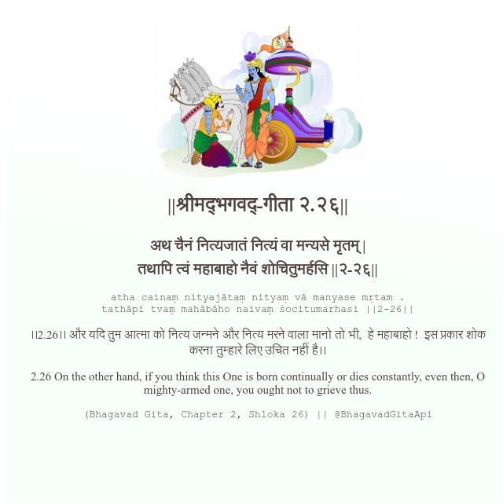

<h2>||श्रीमद्‍भगवद्‍-गीता २.२६||</h2>
<h3>अथ चैनं नित्यजातं नित्यं वा मन्यसे मृतम् | तथापि त्वं महाबाहो नैवं शोचितुमर्हसि ||२-२६||</h3>
<pre>atha cainaṃ nityajātaṃ nityaṃ vā manyase mṛtam . tathāpi tvaṃ mahābāho naivaṃ śocitumarhasi ||2-26||</pre>

।।2.26।। और यदि तुम आत्मा को नित्य जन्मने और नित्य मरने वाला मानो तो भी,  हे महाबाहो !  इस प्रकार शोक करना तुम्हारे लिए उचित नहीं है।।

<pre>(Bhagavad Gita, Chapter 2, Shloka 26) || @BhagavadGitaApi</pre>
https://docs.bhagavadgitaapi.in/

#API #bhagavadgitaapi #slok #nodejs #js #api #gitaapi #krishna #hinduism #vedic #ISKCON #shreemadbhagavadgita #technology

