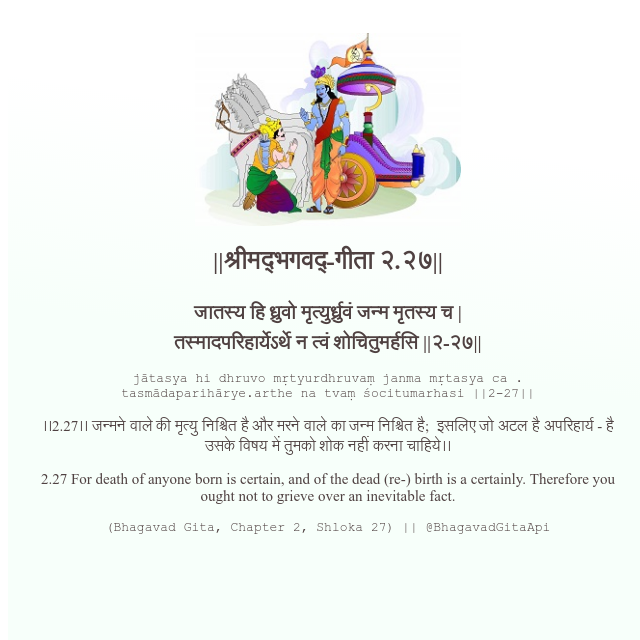

<h2>||श्रीमद्‍भगवद्‍-गीता २.२७||</h2>
<h3>जातस्य हि ध्रुवो मृत्युर्ध्रुवं जन्म मृतस्य च | तस्मादपरिहार्येऽर्थे न त्वं शोचितुमर्हसि ||२-२७||</h3>
<pre>jātasya hi dhruvo mṛtyurdhruvaṃ janma mṛtasya ca . tasmādaparihārye.arthe na tvaṃ śocitumarhasi ||2-27||</pre>

।।2.27।। जन्मने वाले की मृत्यु निश्चित है और मरने वाले का जन्म निश्चित है;  इसलिए जो अटल है अपरिहार्य - है उसके विषय में तुमको शोक नहीं करना चाहिये।।

<pre>(Bhagavad Gita, Chapter 2, Shloka 27) || @BhagavadGitaApi</pre>
https://vedicscriptures.github.io/

#API #bhagavadgitaapi #slok #nodejs #js #api #gitaapi #krishna #hinduism #vedic #ISKCON #shreemadbhagavadgita #technology

