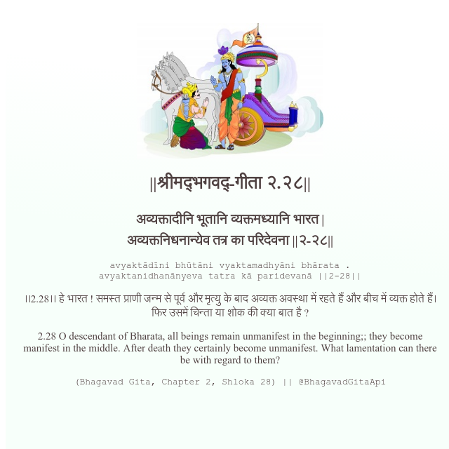

<h2>||श्रीमद्‍भगवद्‍-गीता २.२८||</h2>
<h3>अव्यक्तादीनि भूतानि व्यक्तमध्यानि भारत | अव्यक्तनिधनान्येव तत्र का परिदेवना ||२-२८||</h3>
<pre>avyaktādīni bhūtāni vyaktamadhyāni bhārata . avyaktanidhanānyeva tatra kā paridevanā ||2-28||</pre>

।।2.28।। हे भारत ! समस्त प्राणी जन्म से पूर्व और मृत्यु के बाद अव्यक्त अवस्था में रहते हैं और बीच में व्यक्त होते हैं। फिर उसमें चिन्ता या शोक की क्या बात है ?

<pre>(Bhagavad Gita, Chapter 2, Shloka 28) || @BhagavadGitaApi</pre>
https://docs.bhagavadgitaapi.in/

#API #bhagavadgitaapi #slok #nodejs #js #api #gitaapi #krishna #hinduism #vedic #ISKCON #shreemadbhagavadgita #technology

