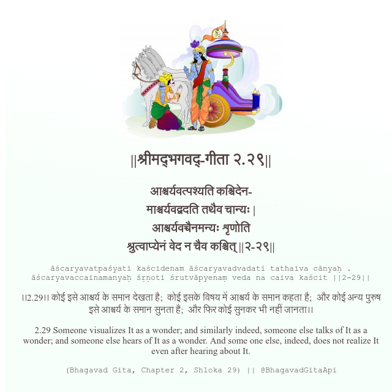

<h2>||श्रीमद्‍भगवद्‍-गीता २.२९||</h2>
<h3>आश्चर्यवत्पश्यति कश्चिदेन- माश्चर्यवद्वदति तथैव चान्यः | आश्चर्यवच्चैनमन्यः शृणोति श्रुत्वाप्येनं वेद न चैव कश्चित् ||२-२९||</h3>
<pre>āścaryavatpaśyati kaścidenam āścaryavadvadati tathaiva cānyaḥ . āścaryavaccainamanyaḥ śṛṇoti śrutvāpyenaṃ veda na caiva kaścit ||2-29||</pre>

।।2.29।। कोई इसे आश्चर्य के समान देखता है;  कोई इसके विषय में आश्चर्य के समान कहता है;  और कोई अन्य पुरुष इसे आश्चर्य के समान सुनता है;  और फिर कोई सुनकर भी नहीं जानता।।

<pre>(Bhagavad Gita, Chapter 2, Shloka 29) || @BhagavadGitaApi</pre>
https://vedicscriptures.github.io/

#API #bhagavadgitaapi #slok #nodejs #js #api #gitaapi #krishna #hinduism #vedic #ISKCON #shreemadbhagavadgita #technology

