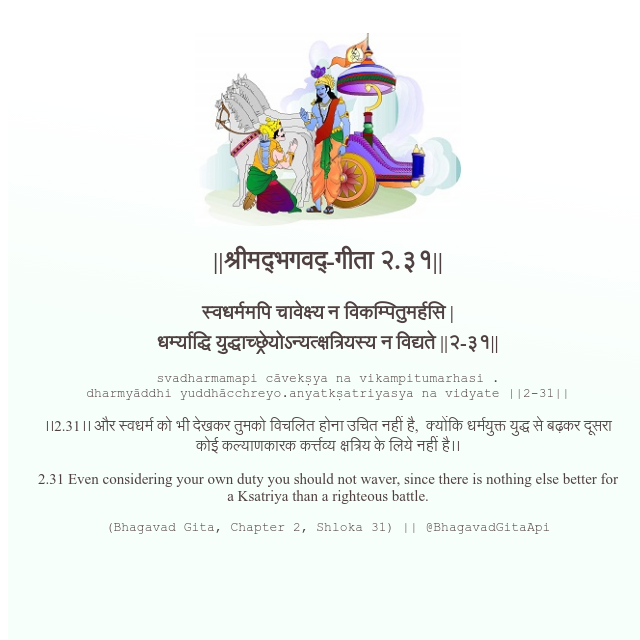

<h2>||श्रीमद्‍भगवद्‍-गीता २.३१||</h2>
<h3>स्वधर्ममपि चावेक्ष्य न विकम्पितुमर्हसि | धर्म्याद्धि युद्धाच्छ्रेयोऽन्यत्क्षत्रियस्य न विद्यते ||२-३१||</h3>
<pre>svadharmamapi cāvekṣya na vikampitumarhasi . dharmyāddhi yuddhācchreyo.anyatkṣatriyasya na vidyate ||2-31||</pre>

।।2.31।। और स्वधर्म को भी देखकर तुमको विचलित होना उचित नहीं है,  क्योंकि धर्मयुक्त युद्ध से बढ़कर दूसरा कोई कल्याणकारक कर्त्तव्य क्षत्रिय के लिये नहीं है।।

<pre>(Bhagavad Gita, Chapter 2, Shloka 31) || @BhagavadGitaApi</pre>
https://bhagavadgitaapi.in/

#API #bhagavadgitaapi #slok #nodejs #js #api #gitaapi #krishna #hinduism #vedic #ISKCON #shreemadbhagavadgita #technology

