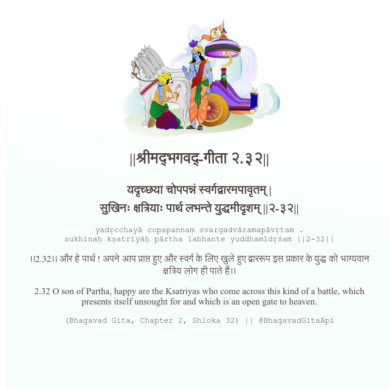

<h2>||श्रीमद्‍भगवद्‍-गीता २.३२||</h2>
<h3>यदृच्छया चोपपन्नं स्वर्गद्वारमपावृतम् | सुखिनः क्षत्रियाः पार्थ लभन्ते युद्धमीदृशम् ||२-३२||</h3>
<pre>yadṛcchayā copapannaṃ svargadvāramapāvṛtam . sukhinaḥ kṣatriyāḥ pārtha labhante yuddhamīdṛśam ||2-32||</pre>

।।2.32।। और हे पार्थ ! अपने आप प्राप्त हुए और स्वर्ग के लिए खुले हुए द्वाररूप इस प्रकार के युद्ध को भाग्यवान क्षत्रिय लोग ही पाते हैं।।

<pre>(Bhagavad Gita, Chapter 2, Shloka 32) || @BhagavadGitaApi</pre>
https://docs.bhagavadgitaapi.in/

#API #bhagavadgitaapi #slok #nodejs #js #api #gitaapi #krishna #hinduism #vedic #ISKCON #shreemadbhagavadgita #technology

