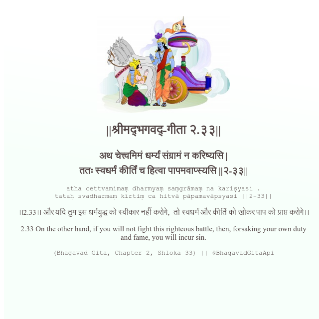

<h2>||श्रीमद्‍भगवद्‍-गीता २.३३||</h2>
<h3>अथ चेत्त्वमिमं धर्म्यं संग्रामं न करिष्यसि | ततः स्वधर्मं कीर्तिं च हित्वा पापमवाप्स्यसि ||२-३३||</h3>
<pre>atha cettvamimaṃ dharmyaṃ saṃgrāmaṃ na kariṣyasi . tataḥ svadharmaṃ kīrtiṃ ca hitvā pāpamavāpsyasi ||2-33||</pre>

।।2.33।। और यदि तुम इस धर्मयुद्ध को स्वीकार नहीं करोगे,  तो स्वधर्म और कीर्ति को खोकर पाप को प्राप्त करोगे।।

<pre>(Bhagavad Gita, Chapter 2, Shloka 33) || @BhagavadGitaApi</pre>
https://docs.bhagavadgitaapi.in/

#API #bhagavadgitaapi #slok #nodejs #js #api #gitaapi #krishna #hinduism #vedic #ISKCON #shreemadbhagavadgita #technology

