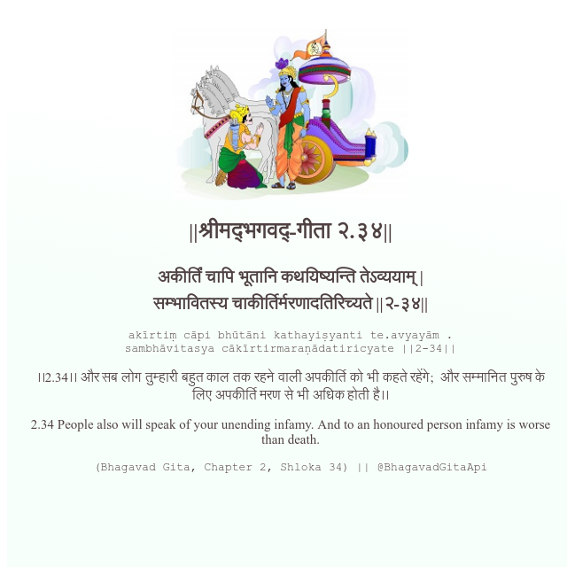

<h2>||श्रीमद्‍भगवद्‍-गीता २.३४||</h2>
<h3>अकीर्तिं चापि भूतानि कथयिष्यन्ति तेऽव्ययाम् | सम्भावितस्य चाकीर्तिर्मरणादतिरिच्यते ||२-३४||</h3>
<pre>akīrtiṃ cāpi bhūtāni kathayiṣyanti te.avyayām . sambhāvitasya cākīrtirmaraṇādatiricyate ||2-34||</pre>

।।2.34।। और सब लोग तुम्हारी बहुत काल तक रहने वाली अपकीर्ति को भी कहते रहेंगे;  और सम्मानित पुरुष के लिए अपकीर्ति मरण से भी अधिक होती है।।

<pre>(Bhagavad Gita, Chapter 2, Shloka 34) || @BhagavadGitaApi</pre>
https://bhagavadgitaapi.in/

#API #bhagavadgitaapi #slok #nodejs #js #api #gitaapi #krishna #hinduism #vedic #ISKCON #shreemadbhagavadgita #technology

