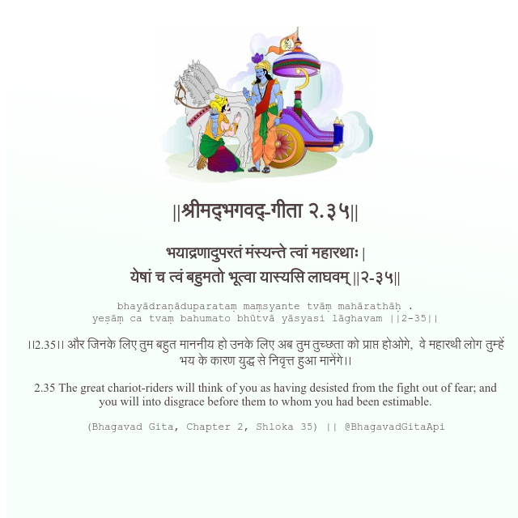

<h2>||श्रीमद्‍भगवद्‍-गीता २.३५||</h2>
<h3>भयाद्रणादुपरतं मंस्यन्ते त्वां महारथाः | येषां च त्वं बहुमतो भूत्वा यास्यसि लाघवम् ||२-३५||</h3>
<pre>bhayādraṇāduparataṃ maṃsyante tvāṃ mahārathāḥ . yeṣāṃ ca tvaṃ bahumato bhūtvā yāsyasi lāghavam ||2-35||</pre>

।।2.35।। और जिनके लिए तुम बहुत माननीय हो उनके लिए अब तुम तुच्छता को प्राप्त होओगे,  वे महारथी लोग तुम्हें भय के कारण युद्ध से निवृत्त हुआ मानेंगे।।

<pre>(Bhagavad Gita, Chapter 2, Shloka 35) || @BhagavadGitaApi</pre>
https://bhagavadgitaapi.in/

#API #bhagavadgitaapi #slok #nodejs #js #api #gitaapi #krishna #hinduism #vedic #ISKCON #shreemadbhagavadgita #technology

