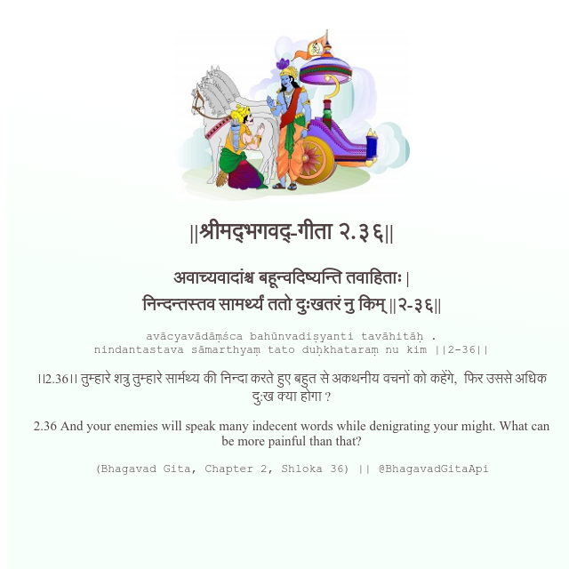

<h2>||श्रीमद्‍भगवद्‍-गीता २.३६||</h2>
<h3>अवाच्यवादांश्च बहून्वदिष्यन्ति तवाहिताः | निन्दन्तस्तव सामर्थ्यं ततो दुःखतरं नु किम् ||२-३६||</h3>
<pre>avācyavādāṃśca bahūnvadiṣyanti tavāhitāḥ . nindantastava sāmarthyaṃ tato duḥkhataraṃ nu kim ||2-36||</pre>

।।2.36।। तुम्हारे शत्रु तुम्हारे सार्मथ्य की निन्दा करते हुए बहुत से अकथनीय वचनों को कहेंगे,  फिर उससे अधिक दु:ख क्या होगा ?

<pre>(Bhagavad Gita, Chapter 2, Shloka 36) || @BhagavadGitaApi</pre>
https://bhagavadgitaapi.in/

#API #bhagavadgitaapi #slok #nodejs #js #api #gitaapi #krishna #hinduism #vedic #ISKCON #shreemadbhagavadgita #technology

