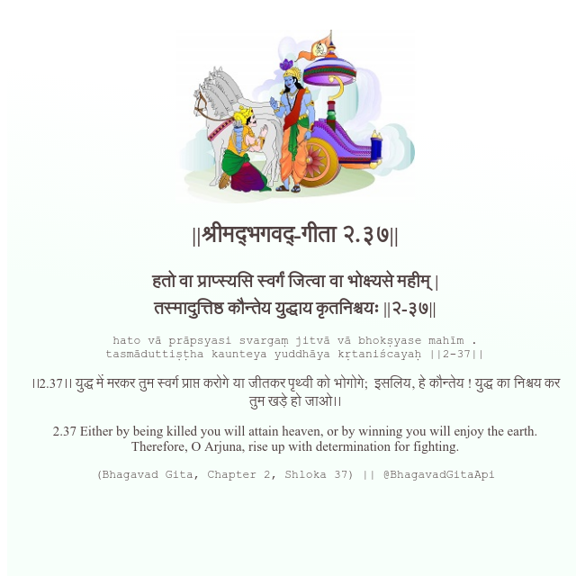

<h2>||श्रीमद्‍भगवद्‍-गीता २.३७||</h2>
<h3>हतो वा प्राप्स्यसि स्वर्गं जित्वा वा भोक्ष्यसे महीम् | तस्मादुत्तिष्ठ कौन्तेय युद्धाय कृतनिश्चयः ||२-३७||</h3>
<pre>hato vā prāpsyasi svargaṃ jitvā vā bhokṣyase mahīm . tasmāduttiṣṭha kaunteya yuddhāya kṛtaniścayaḥ ||2-37||</pre>

।।2.37।। युद्ध में मरकर तुम स्वर्ग प्राप्त करोगे या जीतकर पृथ्वी को भोगोगे;  इसलिय, हे कौन्तेय ! युद्ध का निश्चय कर तुम खड़े हो जाओ।।

<pre>(Bhagavad Gita, Chapter 2, Shloka 37) || @BhagavadGitaApi</pre>
https://docs.bhagavadgitaapi.in/

#API #bhagavadgitaapi #slok #nodejs #js #api #gitaapi #krishna #hinduism #vedic #ISKCON #shreemadbhagavadgita #technology

