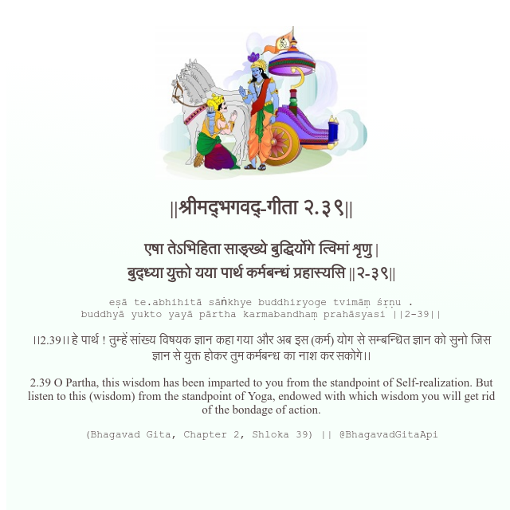

<h2>||श्रीमद्‍भगवद्‍-गीता २.३९||</h2>
<h3>एषा तेऽभिहिता साङ्ख्ये बुद्धिर्योगे त्विमां शृणु | बुद्ध्या युक्तो यया पार्थ कर्मबन्धं प्रहास्यसि ||२-३९||</h3>
<pre>eṣā te.abhihitā sāṅkhye buddhiryoge tvimāṃ śṛṇu . buddhyā yukto yayā pārtha karmabandhaṃ prahāsyasi ||2-39||</pre>

।।2.39।। हे पार्थ ! तुम्हें सांख्य विषयक ज्ञान कहा गया और अब इस (कर्म) योग से सम्बन्धित ज्ञान को सुनो जिस ज्ञान से युक्त होकर तुम कर्मबन्ध का नाश कर सकोगे।।

<pre>(Bhagavad Gita, Chapter 2, Shloka 39) || @BhagavadGitaApi</pre>
https://vedicscriptures.github.io/

#API #bhagavadgitaapi #slok #nodejs #js #api #gitaapi #krishna #hinduism #vedic #ISKCON #shreemadbhagavadgita #technology

