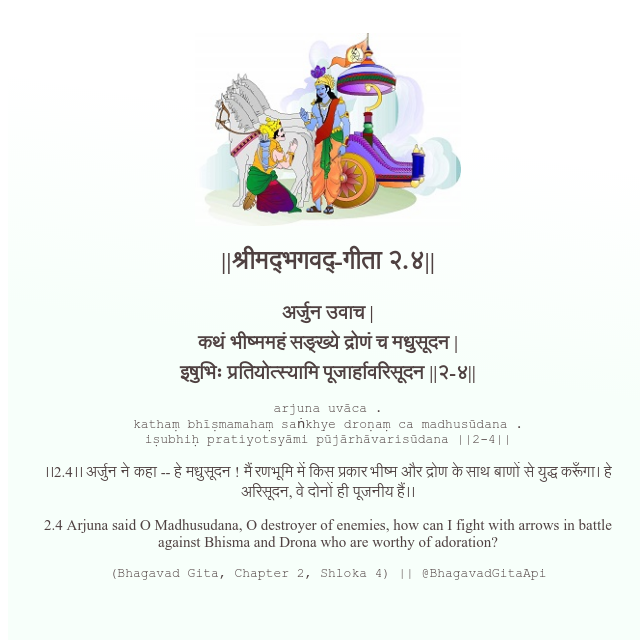

<h2>||श्रीमद्‍भगवद्‍-गीता २.४||</h2>
<h3>अर्जुन उवाच | कथं भीष्ममहं सङ्ख्ये द्रोणं च मधुसूदन | इषुभिः प्रतियोत्स्यामि पूजार्हावरिसूदन ||२-४||</h3>
<pre>arjuna uvāca . kathaṃ bhīṣmamahaṃ saṅkhye droṇaṃ ca madhusūdana . iṣubhiḥ pratiyotsyāmi pūjārhāvarisūdana ||2-4||</pre>

।।2.4।। अर्जुन ने कहा -- हे मधुसूदन ! मैं रणभूमि में किस प्रकार भीष्म और द्रोण के साथ बाणों से युद्ध करूँगा। हे अरिसूदन, वे दोनों ही पूजनीय हैं।।

<pre>(Bhagavad Gita, Chapter 2, Shloka 4) || @BhagavadGitaApi</pre>
https://docs.bhagavadgitaapi.in/

#API #bhagavadgitaapi #slok #nodejs #js #api #gitaapi #krishna #hinduism #vedic #ISKCON #shreemadbhagavadgita #technology

