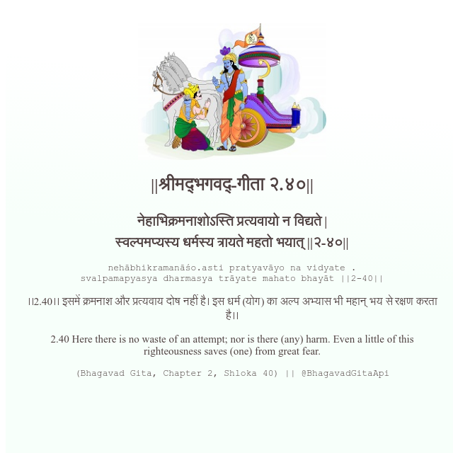

<h2>||श्रीमद्‍भगवद्‍-गीता २.४०||</h2>
<h3>नेहाभिक्रमनाशोऽस्ति प्रत्यवायो न विद्यते | स्वल्पमप्यस्य धर्मस्य त्रायते महतो भयात् ||२-४०||</h3>
<pre>nehābhikramanāśo.asti pratyavāyo na vidyate . svalpamapyasya dharmasya trāyate mahato bhayāt ||2-40||</pre>

।।2.40।। इसमें क्रमनाश और प्रत्यवाय दोष नहीं है। इस धर्म (योग) का अल्प अभ्यास भी महान् भय से रक्षण करता है।।

<pre>(Bhagavad Gita, Chapter 2, Shloka 40) || @BhagavadGitaApi</pre>
https://vedicscriptures.github.io/

#API #bhagavadgitaapi #slok #nodejs #js #api #gitaapi #krishna #hinduism #vedic #ISKCON #shreemadbhagavadgita #technology

